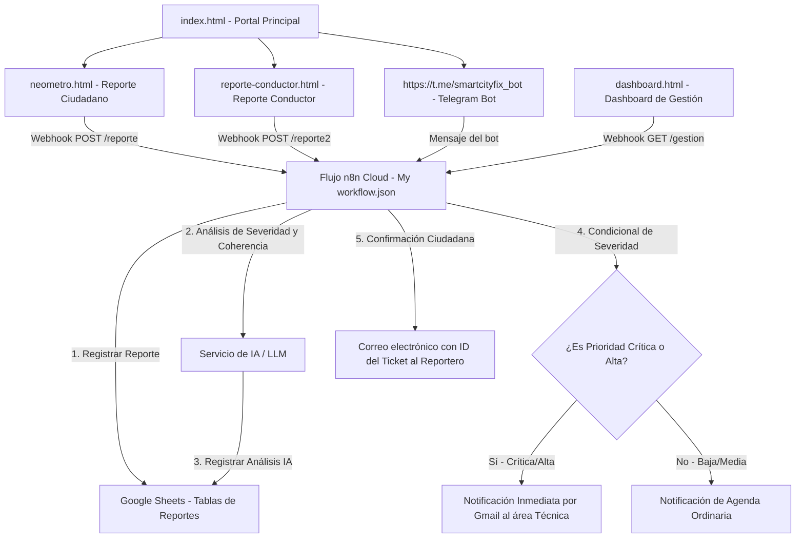

# NeoMetro: Portal Oficial de Reportes en Tiempo Real

**NeoMetro** es un sistema integral e inteligente de reporte y gestión de novedades en tiempo real diseñado para el **Sistema Integrado de Transporte Masivo del Área Metropolitana de Bucaramanga (Metrolínea)**. 

La plataforma permite tanto a **ciudadanos** como a **conductores** reportar incidencias viales, fallas en infraestructura, problemas en buses y riesgos de seguridad. Estos reportes son analizados automáticamente mediante **Inteligencia Artificial** a través de un flujo de automatización en **n8n Cloud**, que se encarga de clasificar la severidad, validar los datos geográficos e históricos, alertar inmediatamente a las unidades técnicas correspondientes y registrar todo en una base de datos centralizada en **Google Sheets**.

---

## Arquitectura del Sistema

El ecosistema de **NeoMetro** está compuesto por tres pilares fundamentales que interactúan de forma fluida:



---

## Características Principales

### 1. Portal Web (Frontend)
El portal está diseñado como una aplicación web moderna y accesible que incluye:
*   **Página de Inicio (`index.html`):** Portal de bienvenida que redirige al usuario a los canales correspondientes (Formulario de Ciudadano, Formulario de Conductor, Dashboard o chat con el Bot de Telegram).
*   **Formulario de Reporte Ciudadano (`neometro.html` / `js/app.js`):**
    *   **Geolocalización en Tiempo Real:** Integración con mapas interactivos de **Leaflet** que permite capturar coordenadas por GPS o posicionando manualmente un pin sobre el mapa.
    *   **Soporte de Evidencia:** Carga dinámica de hasta 5 fotografías (máx. 8MB por imagen en formatos JPG, PNG, WebP).
    *   **Autoguardado Local:** Persistencia automática del formulario mediante `localStorage` para evitar la pérdida de información si la página se recarga accidentalmente.
    *   **Prevención de Duplicados (Idempotencia):** Sistema que bloquea envíos duplicados consecutivos en un rango de 30 segundos.
    *   **Accesibilidad Visual:** Switch integrado para activar el modo de **Alto Contraste** en toda la interfaz.
*   **Portal Rápido de Conductores (`reporte-conductor.html` / `js/driver-report.js`):**
    *   Canal optimizado y ágil para el personal de conducción de Metrolínea.
    *   Autocompletado automático de credenciales y datos del conductor.
    *   Captura inmediata del GPS y hora del suceso al momento de cargar la página para evitar distracciones en ruta.
    *   Panel táctil simplificado de incidencias comunes (retrasos, fallas mecánicas, altercados de pasajeros, vías bloqueadas, etc.).
*   **Dashboard de Gestión y Monitoreo (`dashboard.html` / `js/dashboard.js`):**
    *   **Sincronización en Vivo:** Llama en tiempo real a los webhooks de n8n para obtener y procesar el estado de los tickets.
    *   **Tarjetas de Estadísticas:** Muestra el total de reportes, cantidad de prioridad alta, incidencias de peligro inminente y coordenadas validadas por IA.
    *   **Panel Detallado del Ticket:** Incluye un visor de imágenes (Lightbox) para la evidencia física, un mapa interactivo con la ubicación de la incidencia, y la comparación automatizada de discrepancia entre las coordenadas manuales del ciudadano y la lectura del GPS del teléfono.

### 2. Automatización con n8n Cloud (`My workflow.json`)
La lógica del backend y la integración con servicios externos se gestionan en la nube a través de un flujo centralizado de **n8n Cloud** que realiza los siguientes pasos de manera automatizada:
1.  **Recepción por Webhook:** Expone endpoints HTTP POST para recibir los reportes del portal ciudadano, del portal de conductores y del bot de Telegram.
2.  **Base de Datos en Google Sheets:** Inserta las solicitudes recibidas directamente en una hoja de cálculo unificada.
3.  **Procesamiento y Análisis con IA:** 
    *   Categoriza el tipo de daño de forma automática.
    *   Establece el nivel de severidad (`CRÍTICA`, `MODERADA` o `BAJA`).
    *   Determina si existe un **Peligro Inminente** para la seguridad vial o de pasajeros.
    *   Valida la coherencia entre la descripción textual y la fotografía cargada.
    *   Calcula un índice de confianza del análisis.
4.  **Distribución Inteligente:**
    *   **Prioridad Crítica:** Envía un correo electrónico de alerta urgente al área técnica para su desplazamiento inmediato.
    *   **Prioridad Moderada:** Envía un correo electrónico agendando revisión técnica en las próximas 1 a 2 horas.
    *   **Prioridad Baja:** Agenda una orden de revisión ordinaria para los próximos 2 días.
5.  **Notificación Ciudadana:** Despacha un correo electrónico de confirmación al ciudadano informándole su **Ticket ID** y la prioridad asignada a su novedad.

### 3. Bot de Telegram (`@smartcityfix_bot`)
Un canal alternativo directo para reportar incidencias mediante chat móvil de forma conversacional rápida, que conecta directamente con la automatización principal en n8n Cloud.

---

## Tecnologías Utilizadas

*   **Frontend:** HTML5, CSS3 Moderno (Variables, Flexbox, Grid), JavaScript (ES6+), Leaflet.js para mapas interactivos.
*   **Automatización:** n8n Cloud Workflow Engine.
*   **Base de Datos:** Google Sheets API.
*   **Servicios de IA:** Modelos de Lenguaje Integrados en n8n.
*   **Canales Móviles:** Telegram Bot API.

---

## Estructura del Proyecto

```text
├── assets/
│   └── metrolinea_bus_hero.png       # Imagen representativa de Metrolínea
├── css/
│   ├── styles.css                    # Estilos base y globales de la app
│   ├── landing.css                   # Estilos específicos de index.html
│   ├── driver.css                    # Estilos específicos de reporte-conductor.html
│   └── dashboard.css                 # Estilos específicos de dashboard.html
├── js/
│   ├── app.js                        # Lógica del Portal Ciudadano (<report-form>)
│   ├── driver-report.js              # Lógica del Portal de Conductores (<driver-report-form>)
│   └── dashboard.js                  # Lógica del Dashboard Administrativo (<dashboard-view>)
├── index.html                        # Portal Principal de NeoMetro
├── neometro.html                     # Interfaz de Reportes Ciudadanos
├── reporte-conductor.html            # Interfaz de Reportes para Conductores
├── dashboard.html                    # Interfaz de Monitoreo Administrativo
├── My workflow.json                  # Definición exportada del flujo n8n
└── README.md                         # Documentación del proyecto (Este archivo)
```

---

## Instrucciones de Configuración y Uso

### 1. Configurar y Ejecutar el Frontend
*   Dado que el frontend está desarrollado en Vanilla JavaScript y HTML nativo, no requiere instalación de dependencias complejas. 
*   Puedes servir los archivos utilizando cualquier servidor local simple (por ejemplo, la extensión **Live Server** de VS Code o ejecutando `npx serve .` en la raíz del proyecto).
*   Asegúrate de que las URLs de los Webhooks en los siguientes archivos coincidan con tu instancia activa de **n8n Cloud**:
    *   **Portal Ciudadano:** Variable `this.n8nWebhookUrl` en [js/app.js](js/app.js).
    *   **Portal de Conductor:** Variable `this.n8nWebhookUrl` en [js/driver-report.js](js/driver-report.js).
    *   **Dashboard:** Variable `this.n8nUrl` en [js/dashboard.js](js/dashboard.js).

### 2. Configurar el Flujo en n8n Cloud
1. Inicia sesión en tu cuenta de **n8n Cloud**.
2. En la barra de herramientas del editor de n8n, selecciona **Import from File...** y elige el archivo [My workflow.json](My workflow.json) ubicado en la raíz de tu proyecto.
3. Configura las credenciales requeridas por los nodos en tu cuenta de n8n Cloud:
    *   **Google Sheets:** OAuth2 para acceder al libro de cálculo seleccionado.
    *   **Gmail:** Cuenta autorizada para enviar las alertas técnicas y las respuestas ciudadanas.
4. Asegúrate de configurar los Webhooks en modo activo (**Active**) en la interfaz de n8n Cloud para que comiencen a recibir las peticiones procedentes del portal web y de Telegram.

---

*Desarrollado para el mejoramiento continuo de la movilidad, infraestructura y seguridad urbana del Área Metropolitana de Bucaramanga.*
